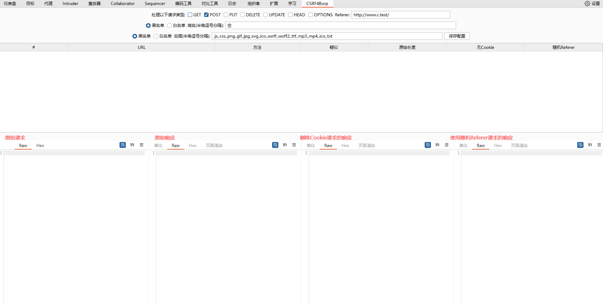
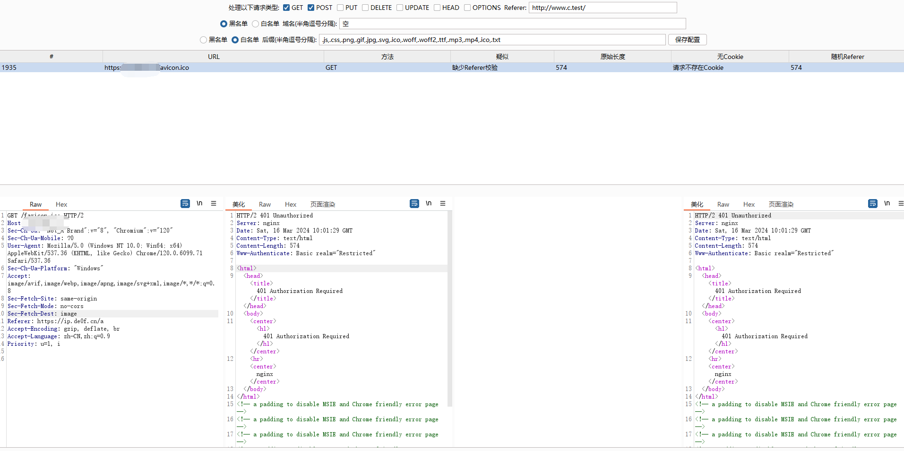

# Csrf4Burp
一款基于BurpSuite的CSRF检测插件
# 免责声明
本工具仅面向**合法授权**的企业安全建设行为，如您需要测试本工具的可用性，请自行搭建靶机环境。

由于传播、利用此工具所提供的信息而造成的任何直接或者间接的后果及损失，均由使用者本人负责，作者不为此承担任何责任。

本人拥有对此工具的修改和解释权。未经网络安全部门及相关部门允许，不得善自使用本工具进行任何攻击活动，不得以任何方式将其用于商业目的。

在安装并使用本工具前，请您**务必审慎阅读、充分理解各条款内容**，限制、免责条款或者其他涉及您重大权益的条款可能会以加粗、加下划线等形式提示您重点注意。 除非您已充分阅读、完全理解并接受本协议所有条款，否则，请您不要安装并使用本工具。您的使用行为或者您以其他任何明示或者默示方式表示接受本协议的，即视为您已阅读并同意本协议的约束。
# 介绍
Csrf4Burp是一款基于BurpSuite的CSRF检测插件，对符合要求的数据包进行Referer的自动更换发包验证，检查目标站点是否可能存在CSRF漏洞。

本插件基于BurpSuite的新版插件API开发（Montoya-Api），可能无法在旧版BurpSuite上使用。

本插件的功能特性如下：
- 通过对比各个情况下的返回包长度，判断是否存在CSRF漏洞
- 支持自定义Referer
- 支持自定义域名黑白名单
- 支持自定义后缀黑白名单
- 支持自定义需要检测的请求方法

# 安装
## 直接安装
下载Release中的jar包，直接在BurpSuite中加载即可。
## 自行编译
下载源码后，使用maven install进行编译

# 使用
在BurpSuite中，选择Extender->Extensions->Add，选择jar包即可加载插件。通过Csrf4Burp面板进行配置，检测结果也会显示在面板上。

# 截图

# 写在最后
#### 本人并不擅长编写Java代码，代码可能存在效率低、设计不合理之处，欢迎大家提Issue或者PR。
#### BurpSuite的新版Api案例较少，本插件可能有使用不当之处，同样欢迎大家提Issue或者PR。
#### 总之希望可以和大家相互交流，共同进步。

# 参考链接
- [BurpSuite新版插件DEMO](https://github.com/PortSwigger/burp-extensions-montoya-api-examples)
- [BurpSuite新版插件DOC](https://portswigger.github.io/burp-extensions-montoya-api/javadoc/index.html)
- [c0ny1 / passive-scan-client](https://github.com/c0ny1/passive-scan-client)

